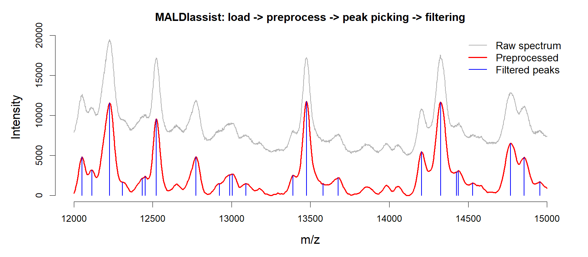
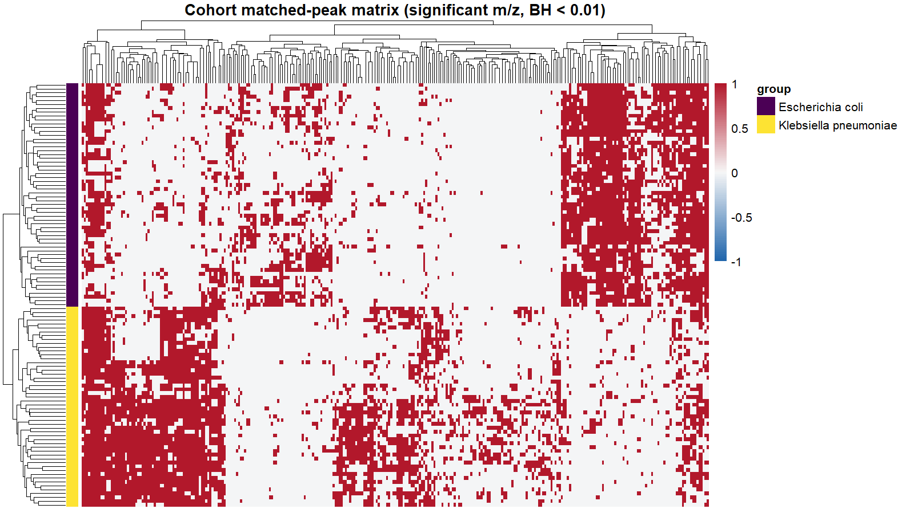

# MALDIassist

<!-- badges: start -->
[](https://doi.org/10.5281/zenodo.21376279)
<!-- badges: end -->

**MALDIassist** provides a set of mathematical utilities for **MALDI-TOF mass spectrometry** workflows in R. It covers the full path from raw Bruker spectra to a cohort-level peak matrix:

- Loading Bruker MALDI-TOF spectra
- Smoothing and baseline correction
- Gaussian KDE-based peak detection (including shoulder peaks)
- Peak-quality metrics and filtering (intensity / prominence / strength)
- Spectrum alignment to internal standards (linear / lowess)
- Cohort feature analysis (frequent m/z discovery, matched peak matrix, two-group significance testing)

Performance-critical routines are implemented in C++ (via [Rcpp](https://www.rcpp.org/)), and list-based functions support multi-core parallel processing.

## Example

The figure below shows the core workflow on real Bruker MALDI-TOF data: a raw spectrum (gray) is smoothed and baseline-corrected (red), then peaks are detected and filtered (blue).



---

## Installation

You can install the development version from GitHub:

```r
# install.packages("remotes")
remotes::install_github("hiows/MALDIassist")
```

---

## Quick start

The pipeline follows six steps: **load → preprocess → KDE → peak picking → peak filtering → visualization**.

```r
library(MALDIassist)
```

### 1. Load

Point `load_maldi_spectra()` at a directory of Bruker flex data files. It returns a named list of raw spectra.

```r
raw_spectra <- load_maldi_spectra(spectra_dir = "data/")
```

### 2. Preprocess

Apply Savitzky-Golay smoothing and baseline subtraction. List-based functions accept `n_cores` for parallel processing.

```r
preprocessed_spectra <- preprocess_maldi_spectra(
  spectra       = raw_spectra,
  hws_sg        = 10,      # half-window size for Savitzky-Golay
  pno_sg        = 3,       # polynomial order
  baseline_type = "snip",  # baseline algorithm
  iter_snip     = 50,      # SNIP iterations
  n_cores       = 4
)
```

Build Gaussian KDE spectra for peak filtering:

```r
kde_spectra <- build_kde_spectra(
  spectra = preprocessed_spectra,
  bw      = 1,
  n_cores = 4
)
```

### 3. Peak picking

`find_peaks_spectra()` detects peaks (including shoulder peaks) using a Gaussian KDE approach.

```r
peaks_list <- find_peaks_spectra(
  spectra                    = preprocessed_spectra,
  bw                         = 1,      # KDE bandwidth
  hws_peaks                  = 10,
  weight_type                = "raw",
  cutoff_kappa_peak_strength = 0.3,
  peak_retention_fraction    = 0.25,
  n_cores                    = 4
)
```

### 4. Peak filtering

`filter_peaks_spectra()` removes low-quality peaks by intensity, prominence, and strength cutoffs.

```r
filtered_peaks_list <- filter_peaks_spectra(
  spectra                = lapply(kde_spectra, `[[`, 1),
  peaks_list             = peaks_list,
  cutoff_peak_intensity  = 100,
  cutoff_peak_prominence = 50,
  cutoff_peak_strength   = 0.5,
  normalization_type     = "raw",
  n_cores                = 4
)
```

### 5. Visualization

Overlay a raw spectrum (gray), its preprocessed version (red), and the filtered peaks (blue) — this reproduces the figure at the top of this README:

```r
example_range <- c(12000, 15000)
i    <- 1
spec <- raw_spectra[[i]]
pp   <- preprocessed_spectra[[i]]
fp   <- filtered_peaks_list[[i]]

in_range <- function(df) subset(df, df[, 1] >= example_range[1] & df[, 1] <= example_range[2])

plot(
  in_range(spec),
  type = "l", col = "gray70", lwd = 1.5,
  ylim = c(0, max(in_range(spec)[, 2])),
  xlab = "m/z", ylab = "Intensity", frame = FALSE
)
lines(in_range(pp), col = "red", lwd = 2)

fp_r <- fp[fp$mz >= example_range[1] & fp$mz <= example_range[2], ]
segments(fp_r$mz, 0, fp_r$mz, fp_r$intensity, col = "blue", lwd = 1.5)
```

You can also overlay all spectra in a single base-R plot:

```r
visualize_spectra(spectra = preprocessed_spectra)
```

---

## Cohort analysis

The example below follows a two-species MALDI-TOF cohort from [PRIDE PXD058284](https://www.ebi.ac.uk/pride/archive/projects/PXD058284): load Bruker spectra and sample metadata, preprocess and pick peaks, align across samples, build a matched-peak matrix, and test for group-discriminating m/z features.

### 1. Load spectra and metadata

```r
library(readxl)

raw_spectra <- load_maldi_spectra(spectra_dir = "data/raw/")
metadata    <- read_xlsx("data/sample_metadata.xlsx")

# two-level species grouping (one label per sample)
sample_group <- metadata$Species[match(names(raw_spectra), metadata$SampleID)]
```

### 2. Preprocess, KDE, and peak picking

```r
preprocessed_spectra <- preprocess_maldi_spectra(
  spectra       = raw_spectra,
  hws_sg        = 10,
  pno_sg        = 3,
  baseline_type = "snip",
  iter_snip     = 50,
  n_cores       = 4
)

kde_spectra <- build_kde_spectra(
  spectra = preprocessed_spectra,
  bw      = 1,
  n_cores = 4
)

peaks_list <- find_peaks_spectra(
  spectra                    = preprocessed_spectra,
  bw                         = 1,
  hws_peaks                  = 10,
  weight_type                = "raw",
  cutoff_kappa_peak_strength = 0.3,
  peak_retention_fraction    = 0.25,
  n_cores                    = 4
)

filtered_peaks_list <- filter_peaks_spectra(
  spectra                = lapply(kde_spectra, `[[`, 1),
  peaks_list             = peaks_list,
  cutoff_peak_intensity  = 100,
  cutoff_peak_prominence = 50,
  cutoff_peak_strength   = 0.5,
  normalization_type     = "raw",
  n_cores                = 4
)
```

### 3. Align spectra

`align_spectra()` corrects m/z drift using internal standards selected from frequent, high-intensity peaks. Choose `"linear"` (two-point) or `"lowess"` (multi-point) alignment. It returns one aligned `spectrum` / `peaks` pair per sample (in `alignment_results`) plus the reference `standard_mz` values used as anchors.

```r
aligned <- align_spectra(
  spectra        = lapply(kde_spectra, `[[`, 1),
  peaks_list     = filtered_peaks_list,
  bin_width      = 20,
  alignment_mode = "linear",  # or "lowess"
  hws_alignment  = 50
)

aligned_peaks <- lapply(aligned$alignment_results, `[[`, "peaks")
exclude_mz    <- aligned$standard_mz   # alignment anchors, excluded below
```

### 4. Find frequent m/z values

`find_frequent_mz()` scans pooled peak m/z values across the aligned samples and refines each bin location with Gaussian KDE. Pass the alignment anchors to `exclude_mz` so the internal standards are dropped from the feature set.

```r
freq_mz <- find_frequent_mz(
  peaks_list = aligned_peaks,
  bin_width  = 20,
  exclude_mz = exclude_mz
)
```

### 5. Build a matched peak matrix

`build_matched_matrix()` matches each sample's peaks to the frequent m/z references and returns a detection matrix (`detected_matrix`) and a signed m/z-difference matrix (`delta_mz_matrix`), both sample-by-marker.

```r
matched <- build_matched_matrix(
  peaks_list   = aligned_peaks,
  reference_mz = freq_mz$mz,
  hws_match    = 10
)

mat <- matched$detected_matrix
```

Visualize the matrix with `heatmap_matched_matrix()`, optionally annotated by a per-sample grouping:

```r
heatmap_matched_matrix(
  matched_matrix = mat,
  group          = sample_group,   # one entry per sample (row)
  hide_rownames  = TRUE,
  hide_colnames  = TRUE
)
```

### 6. Test for significant m/z features

`estimate_significance()` runs a per-feature two-group comparison (t-test or Wilcoxon) on a sample-by-marker matrix and returns raw and adjusted p-values. Subset the matrix to the significant markers to highlight the discriminating features.

```r
sig <- estimate_significance(
  matched_matrix = mat,
  group          = sample_group,   # two-level grouping, one entry per sample
  stat_method    = "t.test",        # or "wilcox"
  adj_method     = "BH"             # "none", "BH", or "bonferroni"
)

heatmap_matched_matrix(
  matched_matrix = mat[, which(sig$adj_pvalue < 0.01)],
  group          = sample_group,
  hide_rownames  = TRUE,
  hide_colnames  = TRUE
)
```

Applied to the PXD058284 two-species cohort (*E. coli* vs *K. pneumoniae*), the significant markers cleanly separate the samples by species:



---

## Main functions

| Function | Purpose |
| --- | --- |
| `load_maldi_spectra()` | Load Bruker raw spectra from a directory |
| `preprocess_maldi_spectra()` | Smooth and baseline-correct spectra |
| `find_peaks()` / `find_peaks_spectra()` | Detect ordinary and shoulder peaks (single / list) |
| `find_peaks_fast()` / `find_peaks_spectra_fast()` | Fast local peak detection (single / list) |
| `filter_peaks()` / `filter_peaks_spectra()` | Filter peaks by intensity, prominence, and strength |
| `build_kde_spectrum()` / `build_kde_spectra()` | Build Gaussian KDE spectra (single / list) |
| `find_frequent_mz()` | Find frequent m/z values across a cohort |
| `align_spectra()` | Align spectra to internal standards (linear / lowess) |
| `build_matched_matrix()` | Assemble a cohort peak intensity matrix |
| `estimate_significance()` | Two-group significance testing per m/z feature |
| `visualize_spectrum()` / `visualize_spectra()` | Visualize spectra with base-R graphics |
| `heatmap_matched_matrix()` | Heatmap of a matched-peak matrix (requires `pheatmap`) |

### Suggested packages

Some functions load optional packages only when used:

- `visualize_spectra()` → `colorspace`
- `heatmap_matched_matrix()` → `pheatmap`

---

## Author

**Wonseok Oh** ([ORCID: 0009-0002-0687-8466](https://orcid.org/0009-0002-0687-8466))

## How to cite

If you use **MALDIassist** in your research, please cite it. From R you can run:

```r
citation("MALDIassist")
```

A BibTeX entry:

```bibtex
@Manual{maldiassist,
  title  = {MALDIassist: Mathematical Utilities for MALDI-TOF Mass Spectrometry},
  author = {Wonseok Oh},
  year   = {2026},
  note   = {R package version 1.0.0},
  url    = {https://github.com/hiows/MALDIassist},
  doi    = {10.5281/zenodo.21376279}
}
```

Archived on Zenodo: [10.5281/zenodo.21376279](https://doi.org/10.5281/zenodo.21376279) (v1.0.0). To cite the software regardless of version, use the concept DOI [10.5281/zenodo.21219451](https://doi.org/10.5281/zenodo.21219451).

## Changelog

### v1.0.0

- **Breaking:** `heatmap_matched_matrix()`: rename argument `groups` → `group` (aligns with `estimate_significance()`)
- Update cohort-analysis README examples and regenerate heatmap figure using PXD058284-based workflow
- Align Quick start README preprocessing/peak-picking parameters with the cohort-analysis example

### v0.1.3

- Rename `plot_spectrum()` / `plot_spectra()` to `visualize_spectrum()` / `visualize_spectra()` and reimplement with base-R graphics (no `ggplot2`)
- Split plotting code into `R/plot.R` (spectra) and `R/heatmap.R` (matched-matrix heatmap)
- Drop the `ggplot2` and `rlang` dependencies

### v0.1.2

- Add `estimate_significance()` for per-feature two-group significance testing (t-test / Wilcoxon) with p-value adjustment
- Rename `build_matched_peaks_matrix()` to `build_matched_matrix()` (returns `detected_matrix` / `delta_mz_matrix`)
- Rename `heatmap_spectrum_matrix()` to `heatmap_matched_matrix()` and add `hide_rownames` / `hide_colnames` options
- Reorder the cohort workflow to align spectra first and exclude alignment standards from frequent m/z discovery

### v0.1.1

- Add `align_spectra()` for linear / lowess m/z alignment using internal standards
- Add `build_kde_spectrum()` and `build_kde_spectra()` for Gaussian KDE spectrum construction
- Refactor `find_frequent_mz()` to accept `peaks_list` input; add `median_intensity` and `freq_ratio` columns
- Change default `weight_type` in `find_peaks()` to `"raw"`
- Update README and CITATION

## License

MIT © 2026 Wonseok Oh. See [LICENSE.md](LICENSE.md) for details.
